# Administración de suscripciones y RBAC

Administrar subscripciones y RBACEn esta práctica crearemos usuarios de Azure Active Directory (Azure AD),  roles personalizados de control de acceso basado en roles (RBAC) de Azure y asignaremos estos roles a usuarios de Azure AD. Es importante tener los permisos necesarios para estas pruebas.

## Objetivos

- Tarea 1: Implementar grupos de administración
- Tarea 2: Crear funciones de RBAC personalizadas
- Tarea 3: Asignar funciones de RBAC

## Diagrama de arquitectura

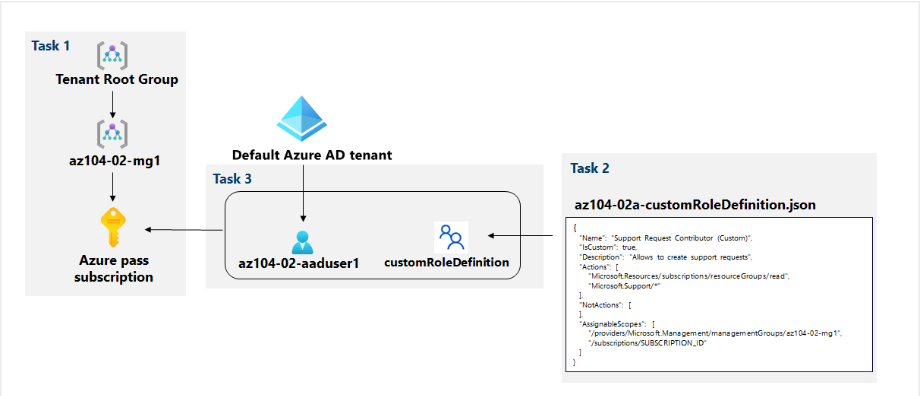

## Instrucciones

### Ejercicio 1

#### Tarea 1: Implementar grupos de administración

1. Inicia sesión en el [**portal de Azure**](http://portal.azure.com/) .

2. Busca y selecciona **Grupos de administración** para navegar a la hoja **Grupos de administración .**

3. Revisa los mensajes en la parte superior de la hoja **Grupos de administración .** Si ve el mensaje que indica **que está registrado como administrador del directorio pero no tiene los permisos necesarios para acceder al grupo de administración raíz**.

   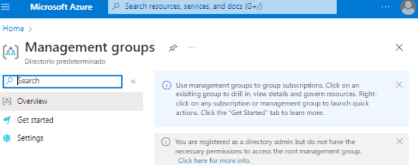

   Hemos de activar los permisos dentro del directorio activo. La ruta que seguiremos será la siguiente: ***Azure AD>manage>propierties > acces management -> yes***

   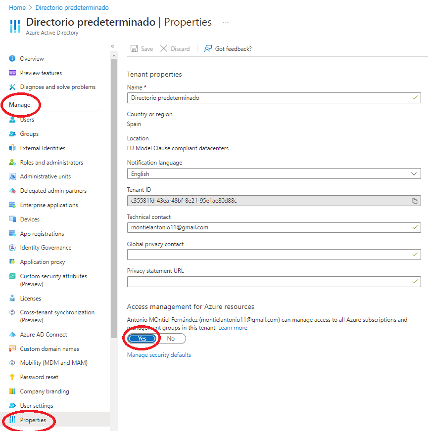

   

4. En la hoja **Grupos de administración , haga clic en** **+ Crear** . Rellenaremos con la siguiente configuración:

   | Settings                      | Value            |
   | ----------------------------- | ---------------- |
   | Management group ID           | **az104-02-mg1** |
   | Management group display name | **az104-02-mg1** |

   Una vez creado el grupo, entramos y añadimos la suscripción:

   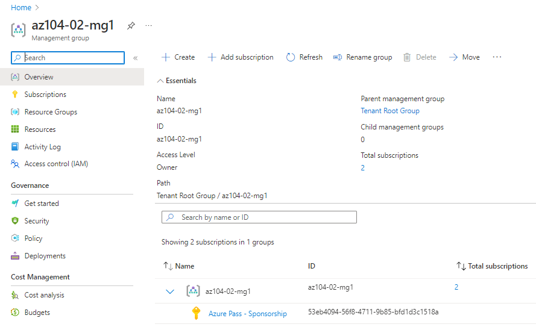

   Guardamos el id de subscripcion, que en mi caso es *53eb4094-56f8-4711-9b85-bfd1d3c1518a*.

   ### Tarea 2: Crear funciones de RBAC personalizadas

   ------

   Nuestro profesor nos ha facilitado este archivo json: 

   

   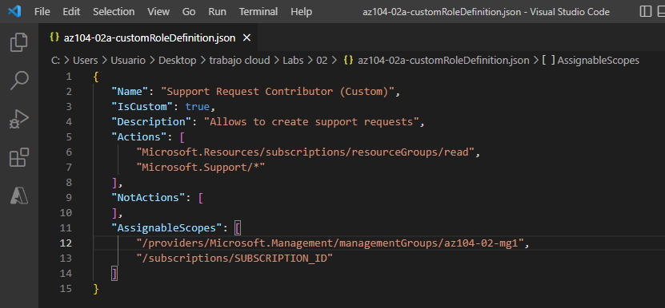

   

   

   Lo que haremos ahora será modificar el alcance poniendo el suscription ID al final de:

   *"AssignableScopes": [*

    *"/providers/Microsoft.Management/managementGroups/az104-02-mg1",*

    *"/subscriptions/**53eb4094-56f8-4711-9b85-bfd1d3c1518a"***

   **Opcionalmente podriamos cambiar el nombre a nuestro gusto.

   Subimos nuestro archivo .json a Azure a través de Powershell:

   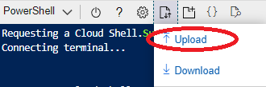

   

   Y ejecutamos el siguiente comando:

   ***New-AzRoleDefinition -InputFile $HOME/az104-02a-customRoleDefinition.json***

   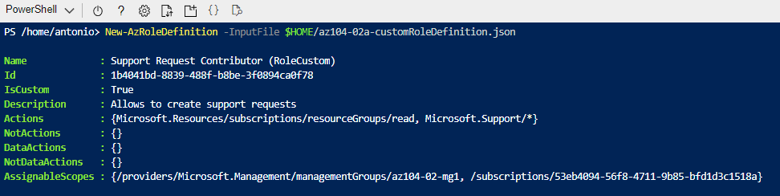

   

### Tarea 3: Asignar funciones de RBAC

Crearemos un usuario de Azure Active Directory, asignaremos la función RBAC que se creó en la tarea anterior a ese usuario y verificaremos que el usuario puede realizar la tarea especificada en la definición de la función RBAC.

***Home>Azure AD>Users>New User***

Creamos un nuevo usuario

| Settings                   | Value                         |
| -------------------------- | ----------------------------- |
| User name                  | **az104-02-aaduser1**         |
| Name                       | **az104-02-aaduser1**         |
| Let me create the password | enabled                       |
| Initial password           | **Provide a secure password** |

Copiamos el nombre junto con el dominio ya que posteriormente nos hará falta

​	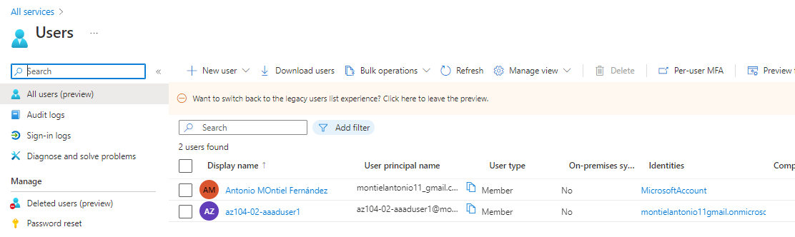

Ahora iremos hacia asignación de roles:***Grupos de Administracion>az104-02-mg1> IAM(Control Acceso)>+Add***

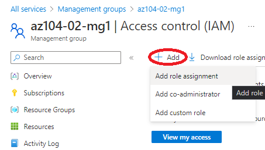

Añadimos el rol custom que insertamos anteriormente a través de Powershell dentro de nuestro grupo de administración y seleccionamos como miembro el ultimo usuario que se creó:

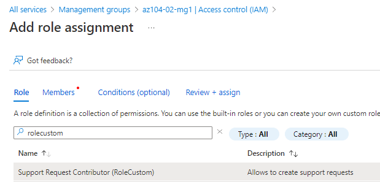

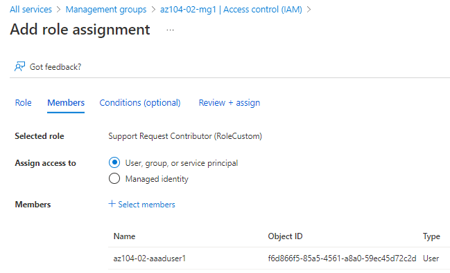

Comprobaremos las limitaciones.

Dentro de una ventana en incognito accedemos con el nuevo usuario, el cual podrá ver los **grupos de recursos**:

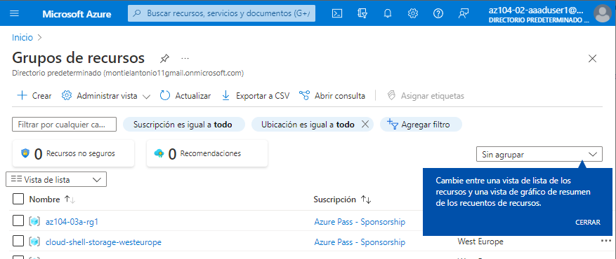

No podra ver nada dentro de la pestaña **Todos los recursos**:

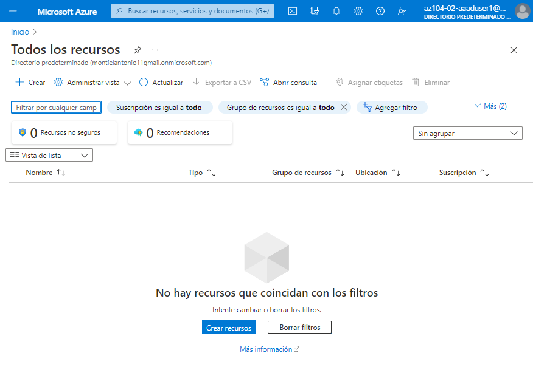

Y podrá ir a la parte de Soporte y ayuda por lo que la asignación se implementó correctamente.

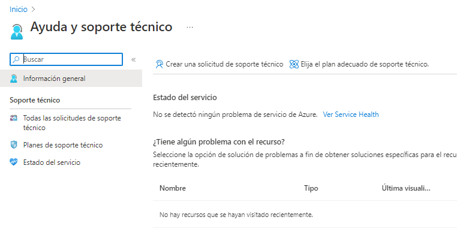

Cerramos la pestaña del navegador del nuevo usuario.

### Tarea 4: Limpiar recursos

------

Haremos los siguientes pasos:

Azure AD> Users>Profile

Copiamos Object ID del nuevo usuario creado y abrimos PowerShell para ejecutar el siguiente comando:

 ***$scope = (Get-AzRoleDefinition -Name 'Support Request Contributor (Custom)').AssignableScopes | Where-Object {$_ -like 'managementgroup'} Remove-AzRoleAssignment -ObjectId '[ObjectID]' -RoleDefinitionName 'Support Request Contributor (Custom)' -Scope $scope***

Donde sustituimos [objet_ID] por el ID del nuevo usuario.

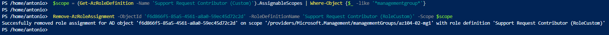

Despues ejecutamos el comando para borrar el rol:

***Remove-AzRoleDefinition -Name 'Support Request Contributor (Custom)' -Force***

En el ultimo paso borraremos el usuario desde Azure AD>Users

Por ultimo vamos a Administracion de grupos y reasociamos nuestra suscripcion al tenant root

***Home>Management Groups>Tenant Root Group> Add Subscription***
